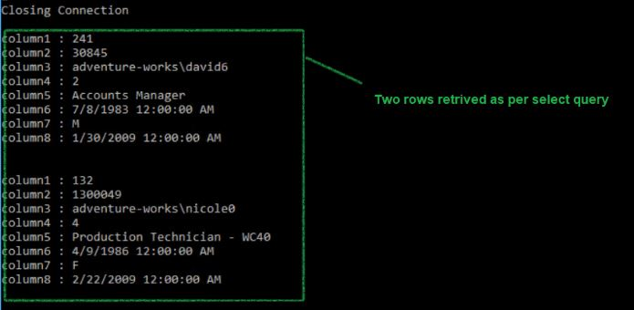

## Query

I need to test connectivity and retrieve values from database on Azure SQL server.

## Solution

Create two files, as below and run 

- TSQL query file
- Powershell 

I saved below Scriptfile ona local path `'..\Select.sql'`

```powershell

DECLARE @SqlCmd VARCHAR(4096);
BEGIN
	SET @SqlCmd = 'SELECT TOP(2) * FROM [dbo].[Employee]';
	PRINT @SQlCmd
	EXEC (@SQlCmd)
END

```

and powershell

```terminal

#region Connect to Azure SQL DB using Service Principal Account 
$TenantId = "XXXXXXXXX-XXXX-XXXX-XXXX-XXXXXXXXXXX"
$ServicePrincipalApplicationId = "XXXXXXXXX-XXXX-XXXX-XXXX-XXXXXXXXXXX"
$SqlServerName = "<Sql Server Name>"
$DatabaseName = '<DatabaseName>'
$clientsecret= "<secret in plain text>"
$ScriptFile = '..\Select.sql'

# Connect to Azure
Connect-AzAccount -ServicePrincipal -Credential $Credential -TenantId $TenantId | Out-Null

# Generate the Token

$body = @{
    scope         = "https://database.windows.net//.default"
    client_id     = $ServicePrincipalApplicationId
    grant_type    = "client_credentials"
    client_secret = $clientsecret
}

$params = @{
    ContentType = "application/x-www-form-urlencoded"
    Headers     = @{ accept = "application/json" }
    Body        = $body
    Method      = "POST"
    URI         = "https://login.microsoftonline.com/$tenantId/oauth2/v2.0/token"
}

$token = Invoke-RestMethod @params
$sqlAccessToken = $token.access_token

#$token

$SqlServerName = $SqlServerName.ToLower()
$DatabaseName = $DatabaseName.ToLower()

Write-Host "Connecting to $DatabaseName"

$query = [IO.File]::ReadAllText($ScriptFile)

$Connection = New-Object System.Data.SQLClient.SQLConnection

$Connection.ConnectionString = "Data Source=tcp:$SqlServerName.database.windows.net,1433;Initial Catalog = $DatabaseName;Connection Timeout=30";
$Connection.AccessToken = $sqlAccessToken

#$Connection

try {
        Write-Host "Opening Connection"
        $Connection.Open()

        Write-Host "Creating Command"
        $Command = $Connection.CreateCommand()
        $Command.CommandText = $query

        $Adapter = New-Object System.Data.sqlclient.sqlDataAdapter $Command
        $dataset = New-Object System.Data.DataSet
        $adapter.Fill($dataSet)

    }
catch [System.Data.SqlClient.SqlException] {
        Write-Host "SqlException...Check your Query and Data then try again"
    }
catch {
        Write-Host "An error occurred"
        Write-Error $_
    }
finally {

        if ($Connection.State -eq "Open") {
            Write-Host "Closing Connection"
            $Connection.Close()

            ## print Dataset after closing connection.
            $dataSet.Tables
        }
} # close finally

```

## Sample Output


